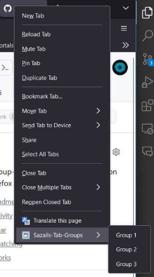
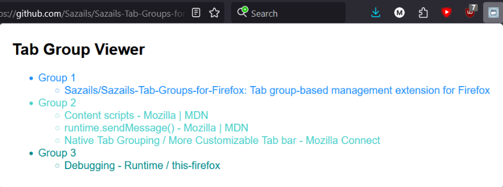

# Sazails Tab Groups for Firefox

## Goal before starting

Create a browser tab group-based management, where tabs can be put into their own groups and minimized.

## Current progress

Managed to create the extension itself with the following features:

- Extension icon pinnable to extension menu-bar.
- GUI to see current groups and tabs under these groups.
- Right-click content-menu for that specific tab with the option to add it and remove it from a group.

## Example usage

1. Right-click on the browser-tab -> Sazails-Tab-Groups -> select group to add to.
2. Repeat step 1 to remove that tab from the group.
3. Click on the extension icon to view the groups and tabs subscribed to the individual groups.

## Encountered road blocks

When I started to write this program the initial idea was to interact with the tabs on the browser itself, however, I could not find a way to directly influence the tabs, not even their colour. I think they do not have an API to allow us to directly talk to the browser GUI.

## What's next?

Giving Mozilla the awareness that this is a useful native functionality to have in your browser that makes others more productive using it. 

If you can please like the post to show Firefox you are interested in the feature.

https://connect.mozilla.org/t5/ideas/native-tab-grouping-more-customizable-tab-bar/idi-p/303

## How to try this out?

1. Open Firefox
2. Type in top search-bar "**about:debugging**"
3. On loaded web-page press "**This Firefox**"
4. Press button "**Load Temporary Add-on**"
5. File explorer should open
6. Select the "**sazails-tab-groups.js**" file. 

Now you can refer to **Example usage** section.

## Example screenshots

 